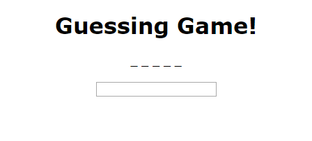
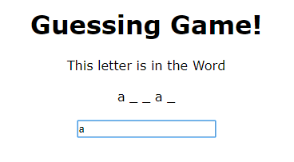
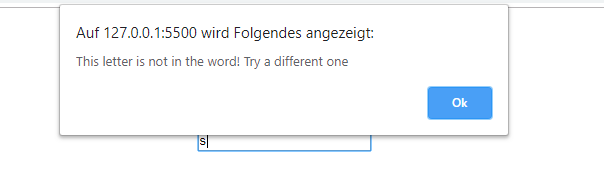
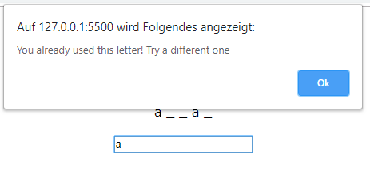

# GUESSING GAME
## Create a guessing word game with JavaScript 

* Estimated time: 2~3 hours.

* Game: 

* The main idea of the exercise is to use the different methods for strings, arrays learned during the Programming Basics module. You can use any methods you want. Now the main functionality of the game:

    - The user will have an input text, where he can write a letter and press the enter key to see if this letter in inside the word. if the letter is in the word show them where this letters appear in the word as showed in the image **(1)**. if the letter is not in the word, an alert would appear telling that this letter is not contained in the word as in image **(2)**. And in the case the letter is in the word but the person already said it, a message like in image **(3)** will appear. The game finish when the user guess the complete word or the user use all of the tries he had. for each incorrect guess or repeated letter the user will lose a try.

* Correct guess: 
 
* Incorrect guess: 
 
* Repeated letter: 
 

***A guidance of the code is in the next parts:***

* **1.** You will have an object with the data of the game: an array with possible words to guess, the chosen word to guess, the word as an array of letters and the number of tries the person have. 
* **2.** For the game some functions to show the letters, word and obtain the input of the user, are given. You just need to code the logic of the game. For this you should code the functions startGame() and Game().
* **3.** For the startGame function you should: 
    - make a random selector to choose a word from the given array, then assign this to the word property of the object. 
    - Create an array full of '_', one of these for each letter of the word and assign it to the property arrayOfLetters. For example:
        - word: array --> arrayOfLetters: ['\_' , '\_' ,'\_' ,'\_' ,'\_']
    - Also assign the number of tries the person will have. 
    - At the end of the startGame function please call the function showWord to show the empty array to the user. 
    - If you think is needed to add some more things to this function for it to works you are free to do it.

--> 
* **4.** For the Game function you will have as a parameter the input that the user would write. For this function accomplish the following tasks:  
    - The idea is to receive a letter, not more than 1. you should make a validation for this.
    - Is up to you the methods to use for the logic of the game. A good approach is to use RegExpressions for the comparation of the word and the input letter.
    - The Game function should assign at the end of each call the following properties to the GameData object:
        - arrayOfLetters in case of positive guess, should add the letter in the correct position. for example: 
        word: array, input: a --> arrayOfLetters: ['A' , '\_' , '\_' , 'a' , '\_'] 
        word: array, input: y --> arrayOfLetters: ['A' , '\_' , '\_' , 'a' , 'y']
        - numberOfTries should decrease in each incorrect guess or repeated letter.
    - After deciding if the guess was correct or incorrect, and the assigns were done, inside the game function a call for the showMessages function should be done with a parameter. This parameter should be true for correct guesses or false for incorrect guesses.
    - The Game function also should validate if the user already guessed the complete word or used all of the tries. In the case of winning the game a call to the showResult function is done, with a parameter equal to true. In case of losing the game, the showResult function is called with a parameter equal to false. Also after this, the game should be restarted by calling the function startGame.

***Enjoy Coding!***

**See the images for reference**